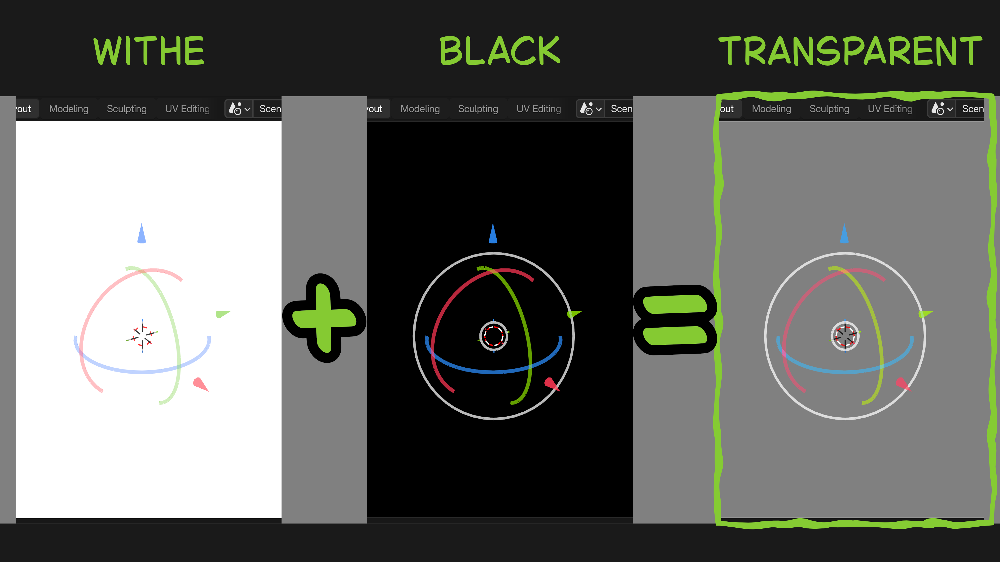
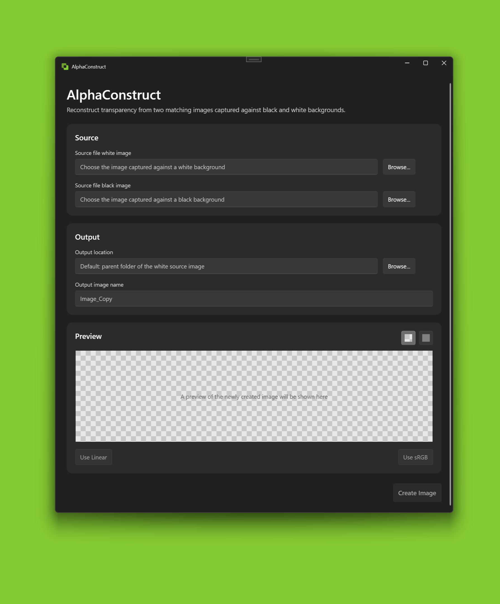
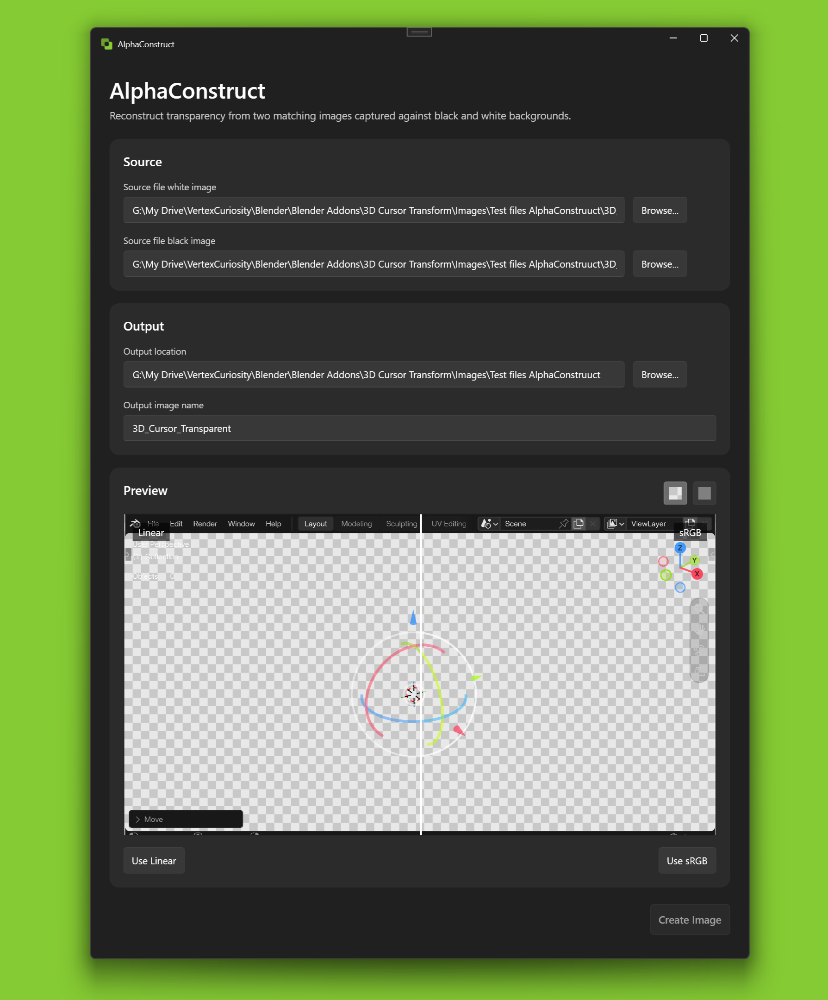
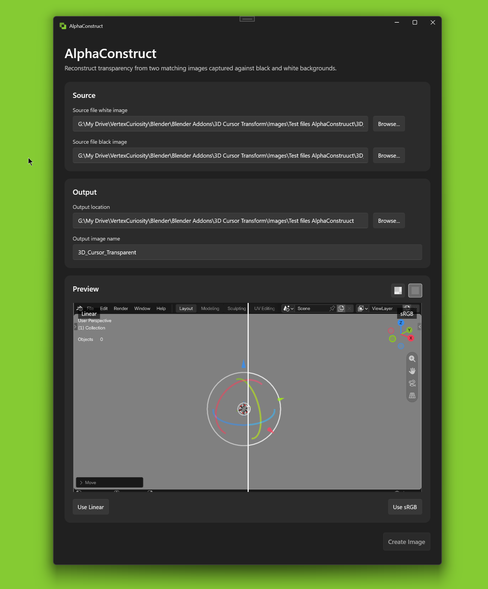

# AlphaConstruct

*A lightweight Windows application for reconstructing transparency from matching images captured against black and white backgrounds.*

AlphaConstruct was created for situations where a transparent image cannot be captured or exported directly, but where you can control the solid background behind it. Capture the exact same image twice — once against a pure black background and once against a pure white background — and AlphaConstruct can use the difference between the two to reconstruct its transparency.

For the reconstruction to work correctly, the two source images must be identical in size and content. Nothing may change between the captures except the background color.

The application generates both linear and sRGB reconstruction results and provides an interactive split preview for comparing the subtle differences between them. The preferred result can then be exported as a transparent PNG.

AlphaConstruct is particularly useful for recovering transparent UI elements, overlays, graphics, renders, and other visual assets when direct alpha export is unavailable.

## Installation

Install AlphaConstruct from the **Microsoft Store**.

Install AlphaConstruct from the **[Microsoft Store](https://apps.microsoft.com/detail/9NC26VXQ0PC6)**.

## Requirements

- Windows 11 (64-bit)

- Windows 10 compatibility has not been verified.

## Highlights

- **Transparency reconstruction**  
  Reconstruct image transparency from two matching captures made against pure black and pure white backgrounds.

- **Linear and sRGB processing**  
  Generates both linear and sRGB reconstruction results, allowing you to choose the result that best matches the original image.

- **Interactive comparison preview**  
  Compare the linear and sRGB results directly using an adjustable split preview.

- **Transparency preview backgrounds**  
  View the reconstructed image against either a checkerboard pattern or a solid background color to help assess transparency, edges, and color.

- **Common image format support**  
  Import all commonly used image formats and export the reconstructed result as a transparent PNG.

## Preview

AlphaConstruct reconstructs transparency from two matching images captured against black and white backgrounds.

The application provides a simple interface for selecting the two source images, choosing the output location and filename, and previewing the reconstructed result before export.

The reconstructed image can be previewed against either a transparency checkerboard or a solid background to help inspect the result.

## Documentation

Complete documentation for AlphaConstruct is available on the [VertexCuriosity website](https://vertexcuriosity.com/addons-and-apps/apps/alphaconstruct).

The documentation explains how to prepare the required source images, reconstruct transparency, compare the Linear and sRGB results, preview the reconstructed image, and export the final transparent PNG.

Topics include:

- Preparing the black and white source images
- Loading the source images
- Linear and sRGB reconstruction
- Previewing and comparing the results
- Checkerboard and solid background previews
- Exporting the transparent PNG
- Limitations and source image requirements
- Privacy and security

## Video Tutorial
A complete walkthrough of ReorderFlow, including installation and practical examples, will be available on YouTube.

Coming soon.

## Contributing

Contributions are welcome!

If you encounter a bug, have a feature request, or would like to contribute code, please open an issue or read the [Contributing Guidelines](CONTRIBUTING.md).

## License

AlphaConstruct is licensed under the **GNU General Public License v3.0 or later (GPL-3.0-or-later)**.

For the complete license text, see the [LICENSE](LICENSE) file.

For information about third-party libraries and their licenses, see [THIRD_PARTY_NOTICES.md](THIRD_PARTY_NOTICES.md).
